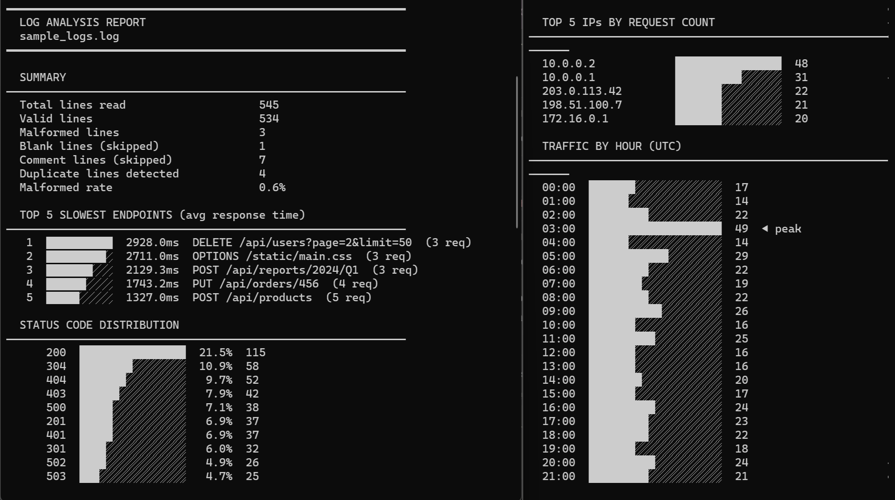
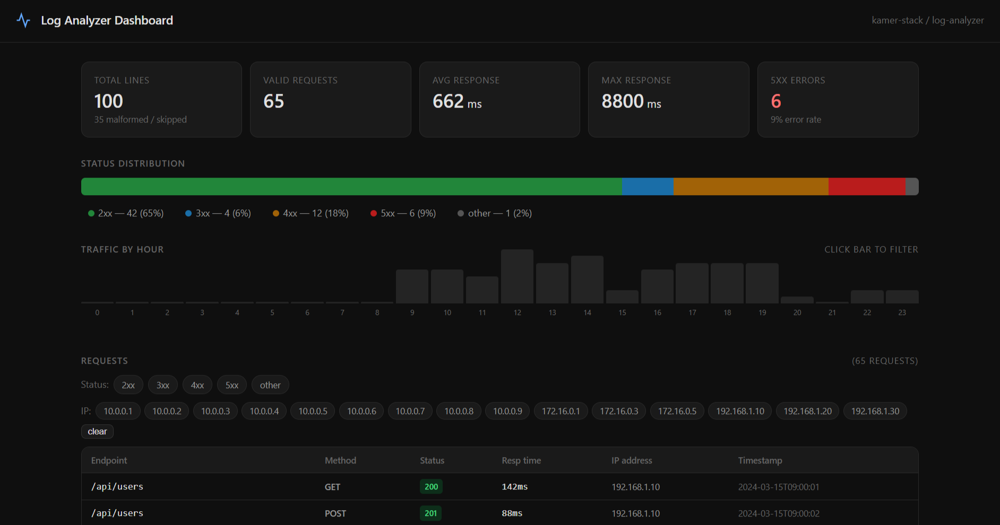
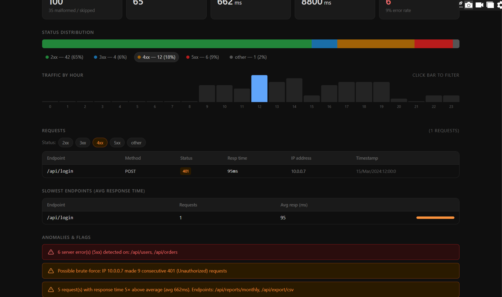

# Log Analyzer

A tool that takes a server log file and produces a useful diagnostic report. Available as both a **Python CLI** and an **interactive web dashboard**.

**Live web dashboard →** https://kamer-stack.github.io/log-analyzer/web_ui.html

---

## Two ways to use it

| | CLI (`analyze.py`) | Web dashboard (`web_ui.html`) |
|---|---|---|
| Input | File path argument | Paste text or upload a file |
| Output | Terminal report | Interactive charts + filters |
| Requires | Python 3.8+ | Any browser — no install |
| Best for | Scripts, CI, large files | Exploring, sharing results |

---

## CLI quickstart

### 1. Generate a test log file

```bash
python scripts/generate_logs.py --seed 42 --lines 500 --output sample_logs.log
```

On Windows, set the encoding first:

```powershell
$env:PYTHONIOENCODING="utf-8"
python scripts/generate_logs.py --seed 42 --lines 500 --output sample_logs.log
```

### 2. Run the analyzer

```bash
python analyze.py sample_logs.log
```

With options:

```bash
python analyze.py sample_logs.log --top 10       # show top 10 slowest endpoints
python analyze.py sample_logs.log --json          # output as JSON
python analyze.py sample_logs.log --no-color      # plain text (for piping)
```

### 3. Run the test suite

```bash
python test_manual.py
```

All 35 tests should pass. Edge case log files used by the tests are in `test_logs/`.

---

## What the output includes

- **Request summary** — total lines parsed, valid vs malformed count, error rate
- **Status code distribution** — breakdown of 2xx / 3xx / 4xx / 5xx
- **Slowest endpoints** — top N endpoints by average response time
- **Traffic by hour** — request volume across the day
- **Anomaly flags** — repeated 401s (brute-force), 5xx spikes, slow outliers
- **Malformed line report** — count of skipped lines, never silently dropped

---

## Log formats supported

The analyzer handles a deliberately messy mix of real-world formats:

```
# Space-separated (assessment spec format)
2024-03-15T14:23:01Z 192.168.1.42 GET /api/users 200 142ms

# JSON-formatted lines (mixed in mid-file)
{"timestamp":"2024-03-15T14:23:05Z","method":"GET","path":"/health","status_code":200,"response_time":"142ms"}
```

**Timestamp variants handled:** ISO 8601, slash date (`2024/03/15`), human month (`15-Mar-2024`), Unix epoch
**Response time variants:** `142ms`, `0.142s`, bare number `142`
**Status code variants:** standard codes, `-` placeholder, missing field
**Bad lines:** blank, truncated, stack traces, non-UTF-8, JSON fragments — all skipped with count

---

## Web dashboard

Open `web_ui.html` in any browser — no server or install needed.

**Features:**
- Drop a `.log` file or paste lines directly
- Click status bar segments or hour bars to filter the request table
- Click any IP address to filter by that client
- Slowest endpoints ranked by average response time
- Anomaly detection: brute-force attempts, 5xx spikes, slow outliers

Or use the live hosted version: https://kamer-stack.github.io/log-analyzer/web_ui.html

---

## Screenshots

### CLI report


### Web dashboard


### Filtered view (click any status segment, hour bar, or IP to filter)


---

## Project structure

```
log_analyzer/
├── analyze.py                    ← CLI analyzer (main tool)
├── web_ui.html                   ← standalone browser dashboard (no install)
├── test_manual.py                ← 35-test edge case verifier
├── README.md
├── ANSWERS.md                    ← assessment questions answered
├── scripts/
│   └── generate_logs.py          ← test log generator with --seed and --lines flags
├── screenshots/
│   ├── terminal_report.png       ← CLI report screenshot
│   ├── web_ui_dashboard.png      ← web dashboard screenshot
│   └── web_ui_filtered.png       ← filtered view screenshot
└── test_logs/
    ├── edge35_empty.log          ← empty file edge case
    ├── edge37_all_malformed.log  ← 100% malformed lines edge case
    └── edge38_no_final_newline.log ← no trailing newline edge case
```

> `sample_logs.log` is not committed — generate it fresh with `python scripts/generate_logs.py`

---

## Requirements

- Python 3.8 or later
- No external packages — standard library only (`re`, `json`, `argparse`, `collections`, `datetime`)
- Windows: set `$env:PYTHONIOENCODING="utf-8"` before running to enable Unicode bar characters in the terminal report

---

## Running against your own log files

The tool accepts any file path — it does not assume a specific filename, line count, or set of values:

```bash
python analyze.py /path/to/your/server.log
python analyze.py /path/to/your/server.log --top 20 --json > report.json
```

